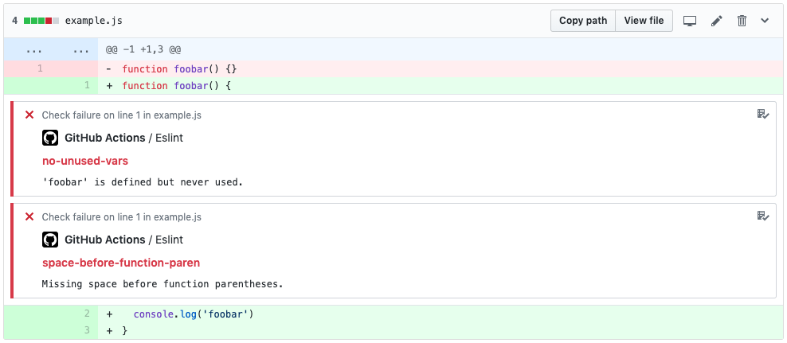

# Github Action for ESLint (with Annotations) in a Mono-Repo

This Action runs [ESLint](https://github.com/eslint/eslint) on your codebase and adds annotations to the Github check the action is run in.



## Usage

```hcl
workflow "Lint" {
  on = "push"
  resolves = ["Eslint"]
}

action "Dependencies" {
  uses = "Knotel/actions/yarn@master"
  args = "install"
}

action "Eslint" {
  uses = "knotel/actions/eslint@master"
  secrets = ["GITHUB_TOKEN"]
  args = ""
  needs = ["Dependencies"]
}
```

### Secrets

* `GITHUB_TOKEN` - **Required**. Required to add annotations to the check that is executing the Github action.

#### Example

To run ESLint, use the Github repo:
 
```hcl
action "Eslint" {
  uses = "Knotel/actions/eslint@master"
  secrets = ["GITHUB_TOKEN"]
  args = ""
}
```

## License

The Dockerfile and associated scripts and documentation in this project are released under the [MIT License](LICENSE).

Container images built with this project include third party materials. View license information for [Node.js](https://github.com/nodejs/node/blob/master/LICENSE), [Node.js Docker project](https://github.com/nodejs/docker-node/blob/master/LICENSE), [ESLint](https://github.com/eslint/eslint/blob/master/LICENSE), [Go](https://golang.org/LICENSE), [google/go-github](https://github.com/google/go-github/blob/master/LICENSE) or [ldez/ghactions](https://github.com/ldez/ghactions/blob/master/LICENSE). As with all Docker images, these likely also contain other software which may be under other licenses. It is the image user's responsibility to ensure that any use of this image complies with any relevant licenses for all software contained within.
